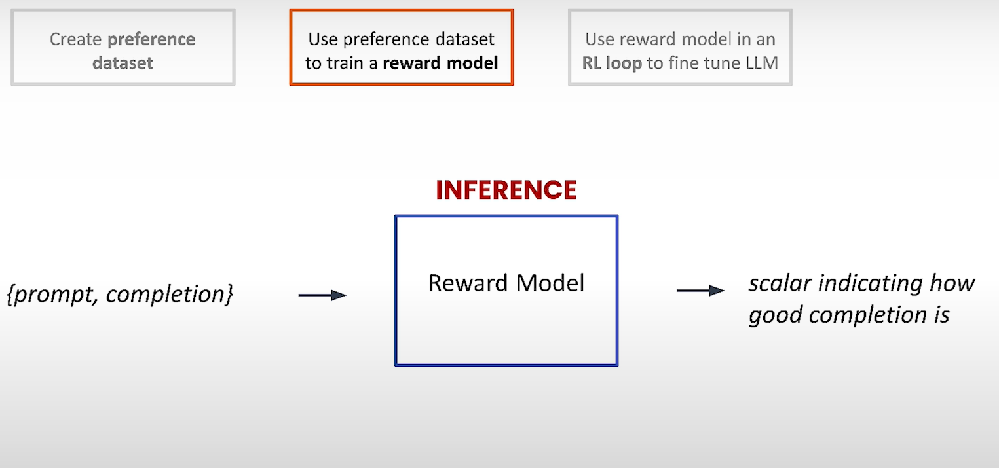
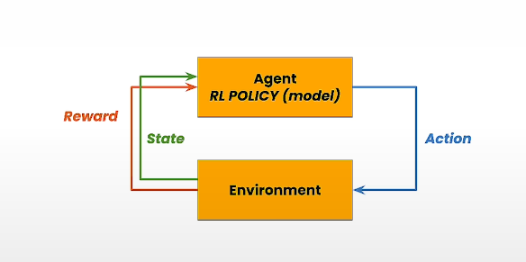
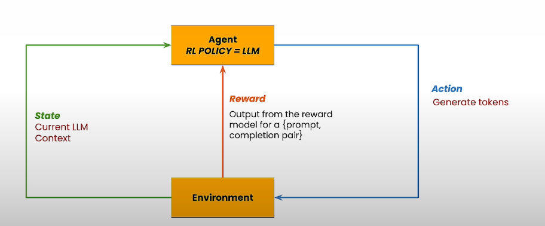
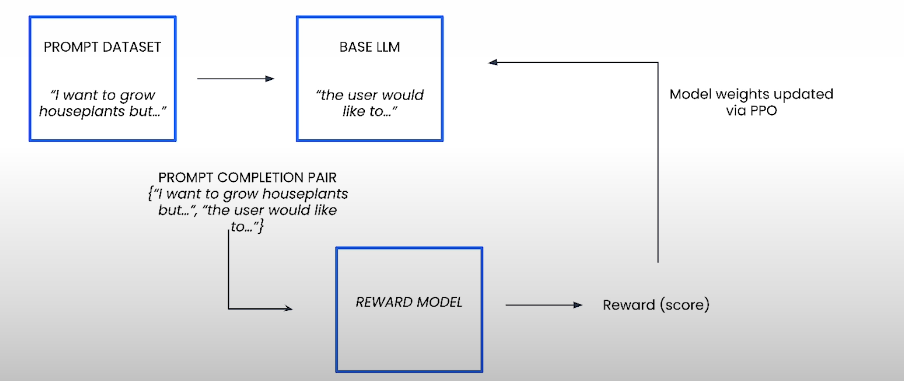
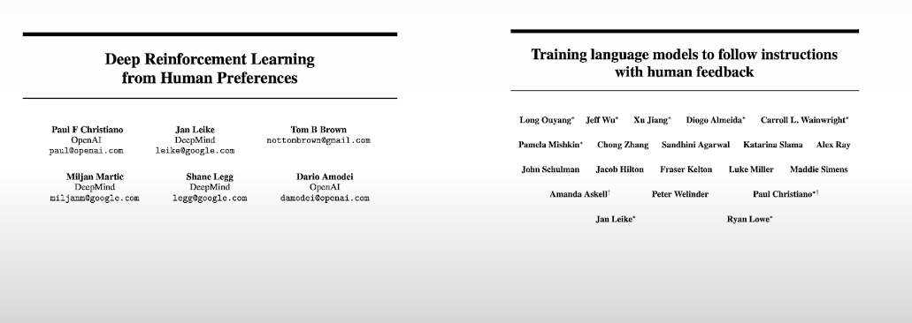

to better align llm output with human intentions and preferences

eg:
Tune a model on summarization task

No one correct way

often many ways - Natural language is flexible

many more valid summary - different audience , different preferences

we are gonna frame this question differently, instead of finding best

we hire a labeller to have two candidate summaries .. and ask him to choose his preferences

[Input -> output (Standard SFT) mapping input to single correct answer]

rather We use RL to produce responses that align with preferences

3 stages : 1. Preference dataset 2. Reward model (we use pref dataset to train reward model supervised training )

3. Then we use reward model to tune the Base LLM

=================
OPENSOURCE llama2 -> 2 datasets[preference dataset, prompt dataset]
=================

Important to note - it tunes based on labeller preferences

choose correct labeller based on usecase(define alignemnt criterria) - less toxic, more positive etc.,

2) -> Use the pref dataset to train reward model (it itself is a LLM)
reward model is a essentially regression model that outputs 'numbers'

{prompt, 2 completions -> 1 winning candidate and 1 losing candidate}

maximize difference between winning candidate and losing candidate

minimize reward model's loss function

given {prompt,completion} -> it produces scalar how good a completion is

3) -> use reward model in RL loop to tune Base LLM

RLHF
(tune LLM to produce completions Maximize reward given by reward model) -> Our Goal

if base LLM is generating completions that better align with preferences of labellers -> then it will recieve higher rewards

Another Dataset - A Prompts dataset(no completions at all)

RL
====

RL --> when we want to train model to solve "complex" and "open ended" objective
we may not know in advance what the optimal solution is, but we can rewards to guide it to optimal paths

Teach agent to learn actions that maximize reward

Agent <state1> ---(actions)---> Env    Env  --(reward along with change of state<state2>)---> Agent

rewards help it to learn the rules of environment
rewards/penalties from performing actions on environment

exploring the space of actions and learns paths adjusting

no supervision(no examples shown)

function(input -> current state of env)  = set of possible actions that agent can take next(along with probs of each action lead to higher reward)

The "function" is called POLICY, goal is to learn a policy that maximizes reward

Policy --> Brain of agent

How it relates to RLHF
=====================

POLICY is Base LLM we want to tune

state - context, current LLM
actions - genrating tokens

each time it generates --> reward model gives a scalar 

PPO is how policy is learned

learn from here 

We can do RLHF using either full finetuning or PEFT